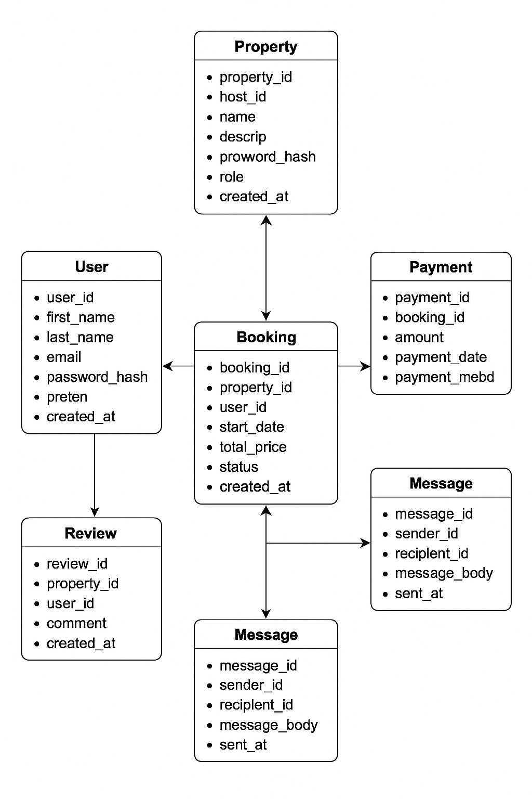

# Airbnb Database - ER Diagram Specification

## Entities and Attributes

### User
- user_id (Primary Key)
- first_name
- last_name
- email
- password_hash
- phone_number
- role (guest, host, admin)
- created_at

### Property
- property_id (Primary Key)
- host_id (Foreign Key → User.user_id)
- name
- description
- location
- price_pernight
- created_at
- updated_at

### Booking
- booking_id (Primary Key)
- property_id (Foreign Key → Property.property_id)
- user_id (Foreign Key → User.user_id)
- start_date
- end_date
- total_price
- status (pending, confirmed, canceled)
- created_at

### Payment
- payment_id (Primary Key)
- booking_id (Foreign Key → Booking.booking_id)
- amount
- payment_date
- payment_method (credit_card, paypal, stripe)

### Review
- review_id (Primary Key)
- property_id (Foreign Key → Property.property_id)
- user_id (Foreign Key → User.user_id)
- rating (1–5)
- comment
- created_at

### Message
- message_id (Primary Key)
- sender_id (Foreign Key → User.user_id)
- recipient_id (Foreign Key → User.user_id)
- message_body
- sent_at

## Relationships

- A User (host) can own many Properties.
- A User (guest) can make many Bookings.
- A Property can have many Bookings.
- A Booking has one Payment.
- A Property can have many Reviews.
- A User can write many Reviews.
- A User can send and receive many Messages (self-referencing).

## Constraints and Indexes

- Unique constraint on User email.
- ENUM constraints on roles, booking status, and payment methods.
- Review rating constrained between 1 and 5.
- Indexes on email, property_id, booking_id.

---
